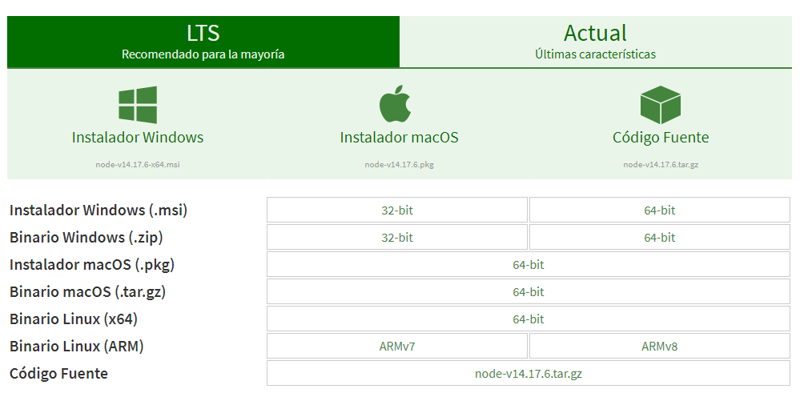
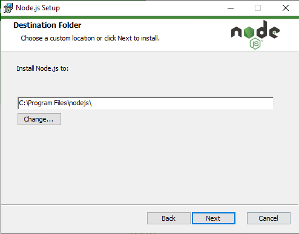
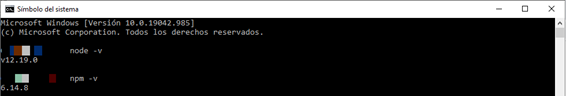

Backend
#######

Introducción
************
En esta sección encontrará toda la documentación e informaión  relacionada con la creación
y configuración del servidor Node.js Express que hace uso de base de datos MySql con el ORM Sequelize.

Requerimientos
**************

El primer requerimiento para implementar el Backend es tener Node instalado en el ordenador.
En caso de que no esté instalado, sigue esta serie de pasos para instalarlo. Basado en este
`tutorial <https://www.cursosgis.com/como-instalar-node-js-y-npm-en-4-pasos/>`__

1. Entrar en https://nodejs.org/es/download/ y dar clic a la opción compatible 
   con el sistema operativo del ordenador.
       

2. Ejecutar el instalador descargado y dar clic en **(Next)** hasta finalizar el proceso
   de instalación.

.. note:: 
   Una vez se complete la instalación, se sugiere verificar la versión de Node.js y NPM
   que se instalaron mediante los siguientes comandos por consola:

.. code-block:: 
   
   node -v

   npm -v

Estos comandos por consola mostrarán un resultado como este:

Estructura Directorio
*********************
.. code-block:: 

   ├───config
   │   ├───config.json
   ├───controllers
   │   ├───skills.controller.js
   │   ├───user.controller.js
   ├───middlewares
   │   ├───jwt_validation.js
   │   ├───validation.js
   ├───models
   │   ├───events.model.js
   │   ├───index.model.js
   │   ├───profile.model.js
   │   ├───profileskills.model.js
   │   ├───skill.model.js
   │   ├───user.model.js
   ├───routes
   │   ├───all.route.js
   │   ├───skills.route.js
   │   ├───user.route.js
   ├───.env
   ├───package-lock.json
   ├───package.json
   ├───Procfile
   ├───.server.js

Ejecutar localmente
*******************

Seguir las instrucciones en el apartado Configuración Inicial descrita en el home de esta 
documentación `ver aquí <../index.html#configuracion-inicial>`_

Documentación
*************

Se procede a crear controladores, middlewares, modelos, rutas necesarias para la creación de nuestra
API REST.

.. toctree::
   :maxdepth: 2
   :caption: Contenido:

   userModel
   profileModel
   skillsModel
   profileskillsModel
   eventsModel
   indexModel

   userController

   userRoute
   skillsRoute
   allRoute

   configurationJSON

   jwtMiddleware  
   validationMiddleware
   
   serverFile