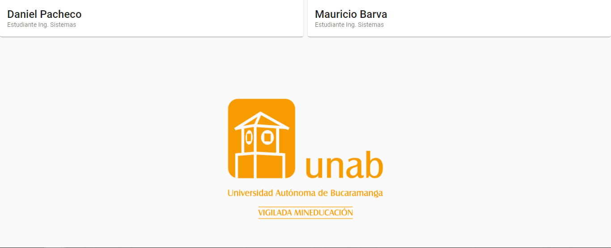

Componente: Home
################

.. note:: 
   Este componente es accesible con o sin haberse logueado en el aplicativo.

Este componente tiene como función ser el vistazo inicial del aplicativo, este componente contiene
una portada con el nombre del equipo de prácticas, información de la universidad, foto y nombre de 
los miembros del equipo.

-  Se realiza la creación del componente ‘Home’ con el siguiente
   comando:

``ng generate component components/dashboard/home``

-  Se procede a efectuar la importación de las diferentes dependencias y
   servicios requeridos en el componente.  Así mismo, se define las variables, 
   los parametros requeridos en el constructor de Angular tal como se aprecia a continuación:

.. literalinclude:: ../../src/app/components/dashboard/home/home.component.ts
   :language: typescript
   :linenos:
   :lines: 1-13

Propiedad: Miembros
*******************

-  Esta propiedad se encarga de alojar la información correspondiente de los integrantes del equipo,
   para posteriormente ser leidas por el material card ubicado en el html.

.. literalinclude:: ../../src/app/components/dashboard/home/home.component.ts
   :language: typescript
   :linenos:
   :lines: 20-23

Código Fuente completo
**********************

.. literalinclude:: ../../src/app/components/dashboard/home/home.component.ts
   :language: typescript
   :linenos:

