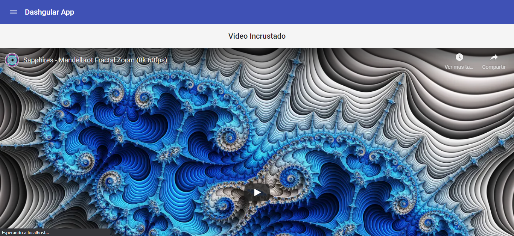

Componente: Video
#################

.. note:: 
   Este componente es accesible con o sin haberse logueado en el aplicativo.

Este componente con el fin de efectos prácticos tiene como función mostrar un video de
youtube incrustado.

-  Se procede a realizar la creación del componente ‘Video’ con el siguiente
   comando:

``ng generate component components/dashboard/video``

-  Se procede a efectuar la importación de las diferentes dependencias requeridos en el componente. 
   Así mismo, se definen los parametros requeridos en el constructor de Angular tal
   como se aprecia a continuación:

.. literalinclude:: ../../src/app/components/dashboard/video/video.component.ts
   :language: typescript
   :linenos:
   :lines: 1-15

Método: Incrustar Video
***********************

-  Este método obtiene y genera una url del video para incrustarla en el componente mediante
   DomSanitizer.

.. literalinclude:: ../../src/app/components/dashboard/video/video.component.ts
   :language: typescript
   :linenos:
   :lines: 20-30

Código Fuente completo
**********************

.. literalinclude:: ../../src/app/components/dashboard/video/video.component.ts
   :language: typescript
   :linenos:

