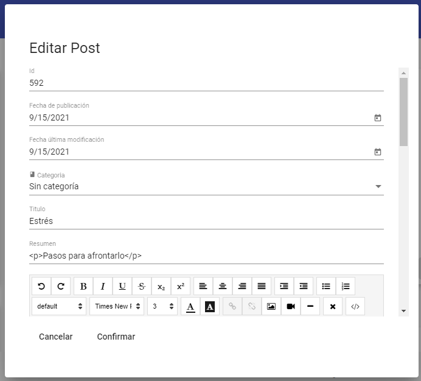
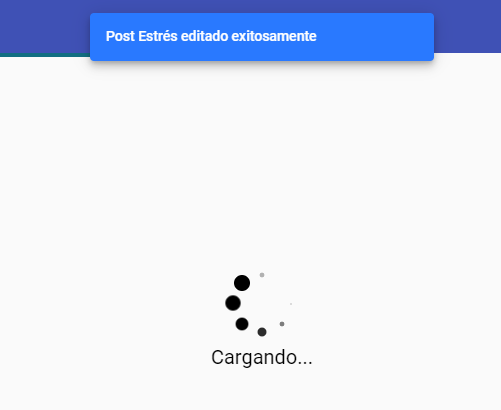

Componente: Blog Edit
#####################

.. warning:: 
   Este componente es sólo accesible cuando el usuario inicia sesion.

Este componente tiene como función mostrar la información detallada de
una entrada del blog elegida por el usuario mediante el método previamente definido en el
Servicio Blog.

Una vez que el usuario modifique alguno de los campos relacionados con la entrada y
de clic en (Confirmar), aparecerá una notificación para confirmar que los cambios
efectuados han sido guardados exitosamente para posteriormente refrescar el componente
Blog en el que podrá apreciar los cambios efectuados.

-  Se procede a realizar la creación del componente ‘Blog Edit’ con el siguiente
   comando:

``ng generate component components/wordpress/blogedit``

-  Se procede a efectuar la importación de las diferentes dependencias,
   servicios y tipos requeridos en el componente. Así mismo, se definen las variables, 
   los parametros requeridos, inyección de los datos del dialogo y el formulario reactivo en el constructor  y se implementan los métodos: obtener detalles del post
   y listado de categorias el inicializador de Angular tal como se aprecia a continuación:

.. literalinclude:: ../../src/app/components/wordpress/blogedit/blogedit.component.ts
   :language: typescript
   :linenos:
   :lines: 1-41

Método: Obtener Detalles Post
*****************************

-  Este método usa la variable ``id`` como parámetro para obtener los detalles  
   de una entrada especifica y hacerlos accesibles desde el componente asignandolos 
   al formulario reactivo: ``editPost``

.. literalinclude:: ../../src/app/components/wordpress/blogedit/blogedit.component.ts
   :language: typescript
   :linenos:
   :lines: 50-63

Método: Obtener Categorias
**************************

-  Este método se encarga de obtener el listado de categorias existentes mediante el 
   método correspondiente definido en el Servicio Blog y hacerlos accesibles desde el componente
   asignandolos a la variable: ``categories``

.. literalinclude:: ../../src/app/components/wordpress/blogedit/blogedit.component.ts
   :language: typescript
   :linenos:
   :lines: 69-74

Función: Guardar Evento
***********************

-  Esta función se encarga de guardar los datos ingresados en el formulario reactivo para
   hacerlos accesibles en el evento Modal Edicción del componente Blog.

.. literalinclude:: ../../src/app/components/wordpress/blogedit/blogedit.component.ts
   :language: typescript
   :linenos:
   :lines: 76-78

Función: Cerrar Evento
***********************

-  Esta función se encarga de notificar el cierre del evento para finalizar el 
   evento Modal Edicción ubicado en el componente Blog.

.. literalinclude:: ../../src/app/components/wordpress/blogedit/blogedit.component.ts
   :language: typescript
   :linenos:
   :lines: 81-83

Código Fuente completo
**********************

.. literalinclude:: ../../src/app/components/wordpress/blogedit/blogedit.component.ts
   :language: typescript
   :linenos:

