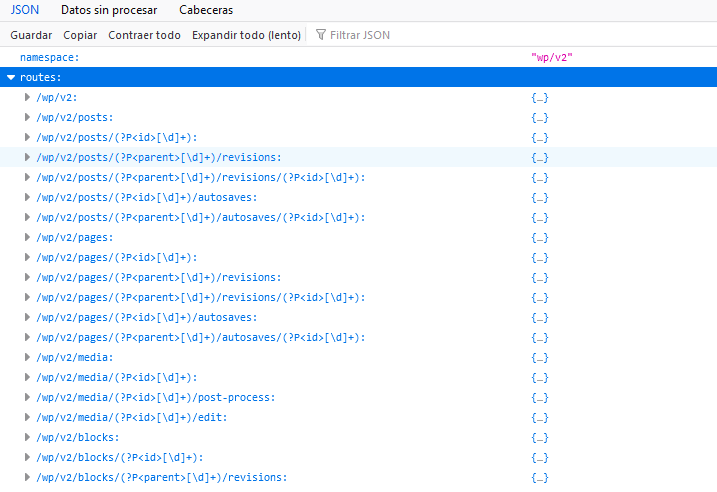
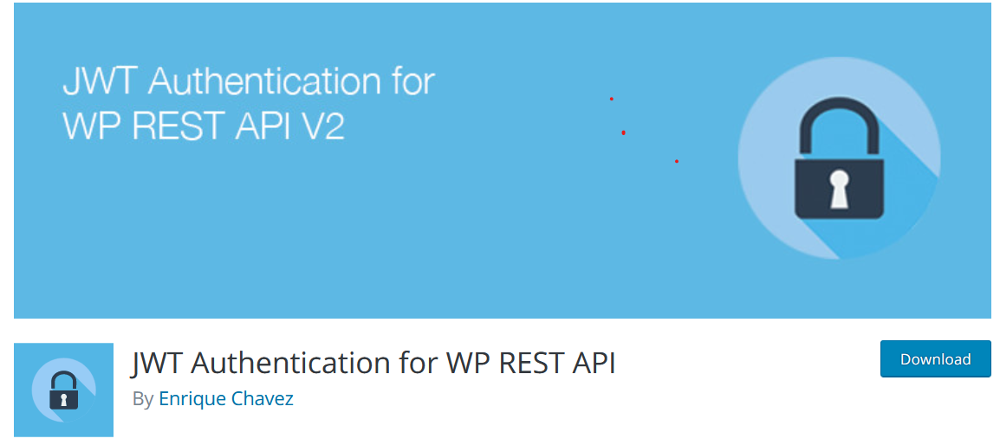

Implementación de Wordpress
###########################

Primer Paso
***********

Se procede a verificar el funcionamiento de la API de WordPress, 
para ello intenta hacer una llamada HTTP a tu sitio WordPress ingresando a la siguiente URL:
http://tudominio.com.com/wp-json/wp/v2 que devolverá un JSON como este:

Segundo Paso
************

Despúes de comprobar el funcionamiento del punto final en la ruta del
sitio, se procede a instalar el siguiente plugin: 
`Plugin WordPressAutenticación <https://wordpress.org/plugins/jwt-authentication-for-wp-rest-api>`_ 
en nuestro sitio WordPress para la autenticación JWT que permitirá la Creación,
Modificación y Eliminación de Posts del blog.

Tercer Paso
***********

.. note::
   Antes de continuar es opcional modificar el entorno del front (Angular) para añadir
   los endpoints que se implementará de la API. De lo contrario, puede definirse en cada
   uno de los servicios en los que se implemente.

.. code:: typescript

   export const environment = {
   production: false,
   APP_REST: {
    BASEURL: 'http://localhost:4200',
    API: 'http://localhost:5000/api',
   },
   WP_REST: {
       API: 'https://tudominio.com/wp-json/wp/v2/',
       AUTH: 'https://tudominio.com/wp-json/jwt-auth/v1/'
   }
   };

Se procede a crear controladores, middlewares, modelos, rutas  servicios y componentes en el
Front (Angular) para efectuar las diferentes llamadas a la rest API.

.. toctree::
   :maxdepth: 1
   :caption: Contenido:

   postInterface
   categoryInterface
   userInterface
   postService
   authService
   guardService
   blogComponent
   blogDetailComponent
   blogDeleteComponent
   blogEditComponent
   blogLoginComponent
   blogNewComponent
   blogFoteerComponent
   
