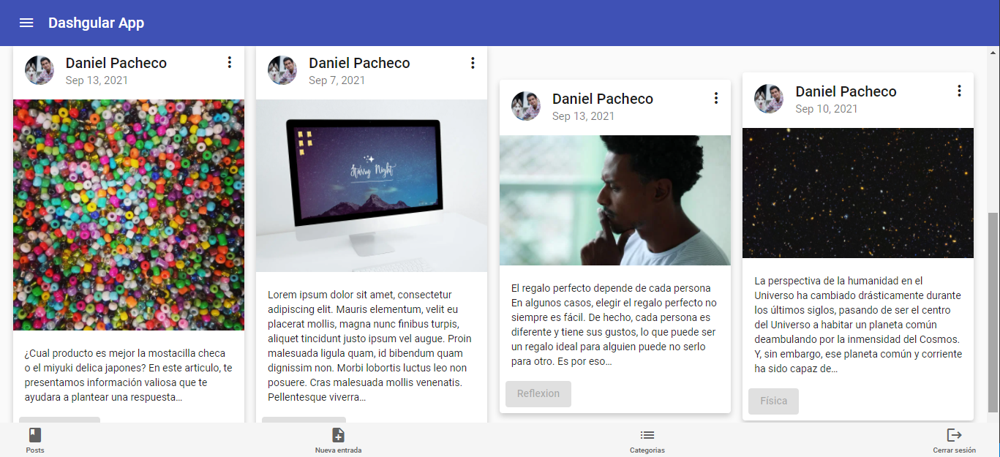

Componente: Blog
################

.. warning:: 
   La apariencia de las tarjetas en las que se contienen las entradas del blog,
   pueden verse alteradas de acuerdo al Método: Validar Logueo.

Este componente tiene como función mostrar el listado de las entradas del blog
obtenidas por el método previamente definido en el Servicio Blog, así mismo, 
permitir la creación, eliminación y modificación de entradas  acorde a cada uno de los
alcances de los métodos creados para dicho fin.

.. figure:: img/BlogComponent.png
   :alt: Vistazo al componente Blog sin auntenticar
   :align: center

Cuando el usuario inicia sesión, el aspecto del componente se modificará para permitir
el acceso a la creación de nuevas entradas, edicción y eliminación de entradas existentes.

-  Se realiza la creación del componente ‘Blog’ con el siguiente
   comando:

``ng generate component components/wordpress/blog``

-  Se procede a efectuar la importación de las diferentes dependencias,
   servicios, otros componentes y tipos requeridos en el componente. 
   Así mismo, se define las variables, los parametros requeridos en el constructor 
   y se implementan los métodos requeridos en el inicializador de Angular tal
   como se aprecia a continuación:

.. literalinclude:: ../../src/app/components/wordpress/blog/blog.component.ts
   :language: typescript
   :linenos:
   :lines: 1-35

Método: Obtener Posts
*********************

-  Este método se encarga de obtener el listado de las entradas
   existentes en el blog.

.. literalinclude:: ../../src/app/components/wordpress/blog/blog.component.ts
   :language: typescript
   :linenos:
   :lines: 38-48

Función: Redirigir
******************

-  Esta se implementa para redirigir eficientemente al usuario a una
   ruta ya que el componente del blog es visible tanto de forma publica
   o privada en el aplicativo.

.. literalinclude:: ../../src/app/components/wordpress/blog/blog.component.ts
   :language: typescript
   :linenos:
   :lines: 50-53

Evento: Modal Edicción
**********************

-  Este se encarga de llamar al método encargado de abrir el modal que
   se ocupará de la edicción de una entrada existente. Así mismo, en este
   evento se define el método ``.afterClosed()`` que se encarga de
   recibir los datos obtenidos del formulario de edicción de la entrada y
   enviarlos al Método Modificar Entrada definida previamente en el Servicio Blog.

.. literalinclude:: ../../src/app/components/wordpress/blog/blog.component.ts
   :language: typescript
   :linenos:
   :lines: 58-86

Evento: Modal Eliminar
**********************

-  Este se encarga de llamar al método encargado de abrir el modal que
   se ocupará de la eliminación de una entrada existente. Así mismo, en este
   evento se define el método ``.afterClosed()`` que se encarga de
   recibir la respuesta de confirmación para enviar el Id del post al
   Método Eliminar Entrada definida previamente en el Servicio Blog.

.. literalinclude:: ../../src/app/components/wordpress/blog/blog.component.ts
   :language: typescript
   :linenos:
   :lines: 88-114

Método: Validar Logueo
**********************

-  Este se encarga de retornar un boleano como respuesta del método
   ``getIsAuth`` definido en el Servicio Autenticación, para validar si
   el usuario se encuentra logueado.

.. literalinclude:: ../../src/app/components/wordpress/blog/blog.component.ts
   :language: typescript
   :linenos:
   :lines: 116-119

Código Fuente completo
**********************

.. literalinclude:: ../../src/app/components/wordpress/blog/blog.component.ts
   :language: typescript
   :linenos:

