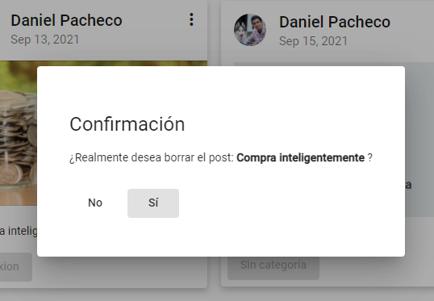
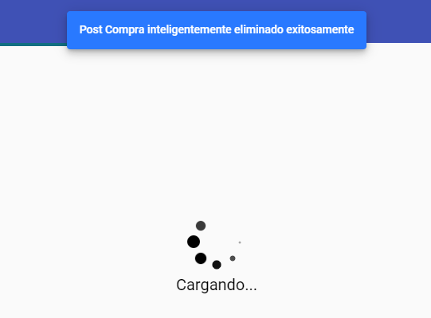

Componente: Blog Delete
#######################

.. warning:: 
   Este componente es sólo accesible cuando el usuario inicia sesion.
   
Este componente tiene como función ser el dialogo de confirmación para borrar
una entrada del blog eligida por el usuario mediante el método previamente 
definido en el Servicio Blog.

Dado el caso que el usuario opte por **(Sí)** eliminar la entrada, aparecerá una notificación
para confirmarle el resultado exitoso. Posteriormente se refrescará el componente Blog
en el que podrá apreciar que ya no se encuentra la entrada eliminada.

-  Se procede a realizar la creación del componente ‘Blog Edit’ con el siguiente
   comando:

``ng generate component components/wordpress/blogdelete``

-  Se procede a efectuar la importación de las diferentes dependencias,
   servicios y tipos requeridos en el componente. Así mismo, se definen las variables, 
   los parametros requeridos e inyección de los datos del dialogo en el constructor, se implementan tambíen 
   los métodos: obtener detalles del post y listado de categorias el inicializador de Angular tal como se aprecia a continuación:

.. literalinclude:: ../../src/app/components/wordpress/blogdelete/blogdelete.component.ts
   :language: typescript
   :linenos:
   :lines: 1-20

Función: Guardar Evento
***********************

-  Esta función se encarga de almacenar la respuesta de confirmación del dialogo para 
   posteriormente leerse en el evento Modal Eliminar en el componente Blog.

.. literalinclude:: ../../src/app/components/wordpress/blogdelete/blogdelete.component.ts
   :language: typescript
   :linenos:
   :lines: 21-23

Función: Cerrar Evento
***********************

-  Esta función se encarga de notificar el cierre del evento para finalizar el 
   evento Modal Eliminar ubicado en el componente Blog.

.. literalinclude:: ../../src/app/components/wordpress/blogdelete/blogdelete.component.ts
   :language: typescript
   :linenos:
   :lines: 25-27

Código Fuente completo
**********************

.. literalinclude:: ../../src/app/components/wordpress/blogdelete/blogdelete.component.ts
   :language: typescript
   :linenos:

